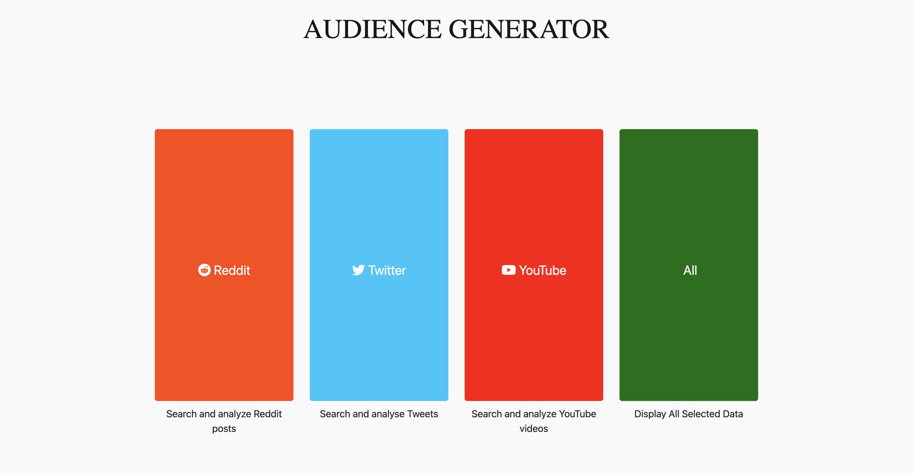
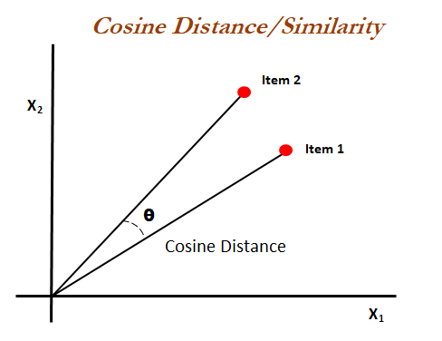
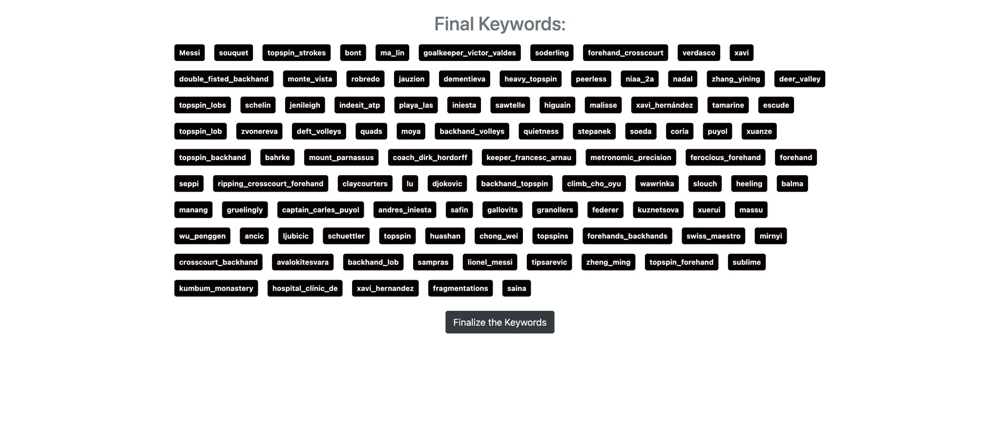
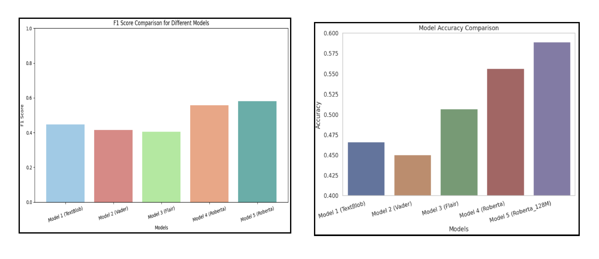
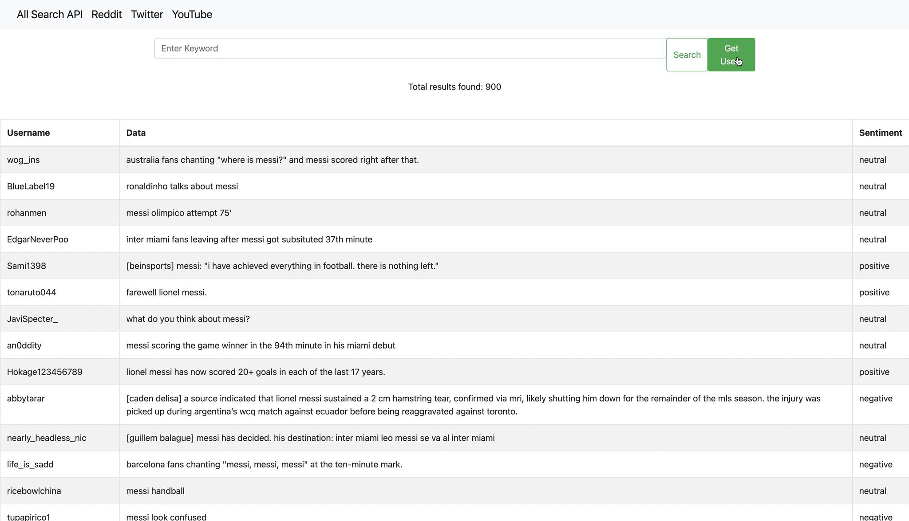
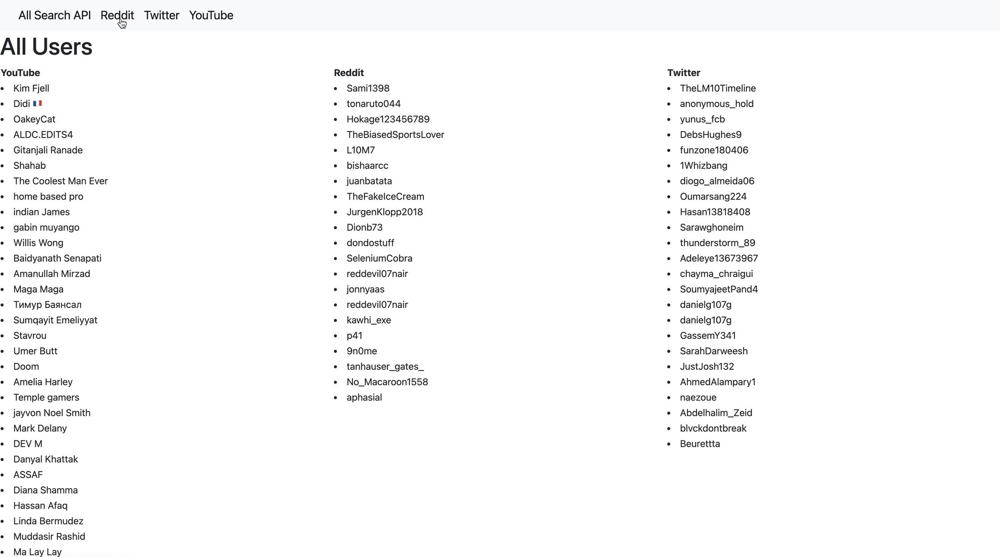

# Machine_Learning_Audience_Generator
## Description
Audience_Generator is a web application designed to create targeted audience profiles based on user-entered keywords. The application retrieves data from social media platforms using ethical practices and APIs, analyzes the sentiment using a RoBERTa-based transformer model, and selects users with positive sentiments to form a curated audience. This tool is ideal for marketers, researchers, and social media managers looking to engage with a positively inclined audience.

## Features
- Data Collection: Live data is collected from the APIs of social media websites such as Reddit, Youtube and Twitter/X
- Keyword Selection: To broaden the scope of data extraction and enhance the dataset's quality, a similar word generation based on cosine similarityby harnessing a pre-trained word2Vec model is implemented.

- Data Preprocessing: Since social media data can be dirty, I have employed various preprocessing techniques such as removing handlers, hashtags, URLs, non-alphanumeric characters, and non-English words. Additionally, I have utilized tokenization and stemming.
- Data Processing: This cleaned data is then sent to a roberta based transformer model which was trained on 124M tweets for sentiment analysis. This model performed better than other models (TextBlob, Vader, Flair).

- Data Storage: Details of users from the positive sentiment analysis is stored which can be used as data for interested users in targeted marketing. For this case I used a Postgresql table to store this data 

- Application once run will search users who have posted anything positive related to the entered search term/topic
* For Reddit and Twitter it will search the best posts related to the topic
* For youtube it will search the video related to the topic and return comments in that video  

- Instructions to run the app:
run the 'main.py' file

- make sure all the libraries are imported from the installed_packages.txt to avoid any errors
- run the main.py file which should launch the flask website

Note: Below are the details used for respective platforms while making API calls for data extraction these can be updated in their respective python files updated_app>routes>python files

- Reddit: The credential for reddit can be created from personal reddit account in the PRAW API
Create personal ID and secret key for reddit

- Twitter: As twitter developer account is paid use it to create a bearer token

BEARER_TOKEN='XXXX'

- YouTube: The credential for Youtube can be created from personal youtube account in the Youtube data API

All credientials which are generated by the personal user account

